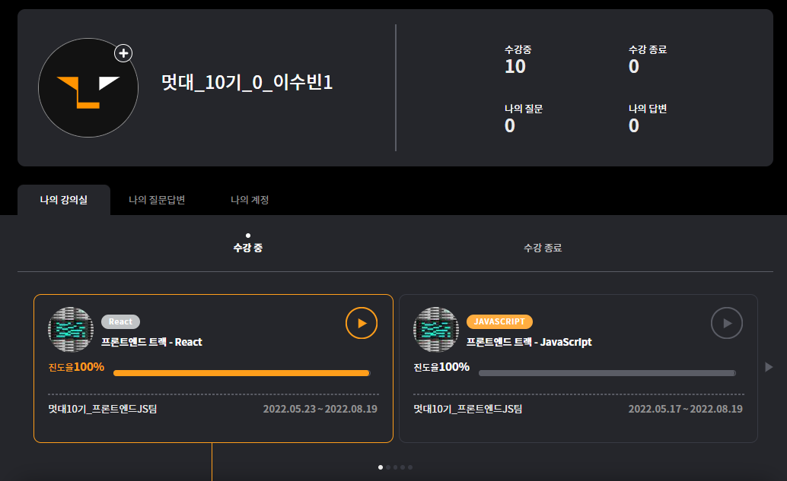

## Chapter1 React기초

### React란?

유저 인터페이스를 만들기 위한 자바스크립트 라이브러리

UX

사용자 경험

UI

사용자 인터페이스

프레임워크

뼈대, 골조, 소프트웨어의 설계와 구현을 위한 상호협력하는 클래스와 인터페이스의 집합

→ 전체 설계와 구현을 주도

라이브러리

소프트웨어를 개발할 때 프로그램이 사용하는 비휘발성 자원의 모임

→ 불려와 사용하는 도구

react 프로젝트 생성방법

yarn create react-app react-study

yarn start

node_modules 

모듈들이 저장되어 있는 폴더

public

정적 파일들이 모여있는 폴더

유용한 도구

- React Developer Tool

각 컴포넌트들이 렌더링되는데 얼마나 걸리는지 알 수 있음

- reactjs code snippets

rfc를 입력해서 기본 리액트 코드 틀을 만들어줌

## Chapter2 JSX다루기

JSX = JS+XML

HTML : 데이터를 화면에 보여줌

XML : 데이터를 저장하고 전달하는 것이 목적, 직접 태그 지정 가능

Babel

JSX를 JS로 변환해줌

JSX를 왜 사용할까?

전체적으로 파악하기 쉽고 직관적이다

React는 선언적 프로그래밍을 한다(결과물을 선언)

JS는 명령형 프로그래밍을 한다

### JSX 문법

1. 하나의 요소로 감싼다

<div> 태그로 감싸면 렌더링이 되었을때 div가 불필요하게 들어감

<Fragment> 태그로 감싸면 출력될때 태그 생략

축약형 → <>

1. 자바스크립트 표현식 사용

{} brackets 감싸기

1. 조건부 렌더링
    
    1) return문 밖에서 if문 사용
    
    2) && || 이용하기
    
    && → 왼쪽의 조건이 참일 경우 실행, || → 거짓일 경우 실행
    
    3) Case 사용
    
    4) 삼항연산자 사용(? :)
    

### Style Basic

인라인 스타일 속성

객체 형태로 들어가야 함

카멜케이스로 작성

```python
<div style=[{ marginTop: "10px", backgroundColor: "red"}]>
<div style=[PracticeStyle]
```

스타일로 들어갈 객체를 미리 선언하여 사용 가능

```python
const PracticeStyle = {
	marginTop: "10px",
	backgroundColor: "blue",
};
```

다른 파일에서 불러오는 법

```python
import "~~~.css";

<div className="red">
```

class가 아닌 className으로 작성

styled component

js에서 css를 그대로 사용할 수 있게 해주는 라이브러리

터미널에 yarn add styled-components

jsx 파일 상단에 설치한 라이브러리 import 해 줌

```python
import styled from 'styled-components';
```

리액트에서 컴포넌트 이름은 대문자로 시작해야 한다

```python
import React from "react";
import styled from 'styled-components';

function Hello(){
  const StyledButton = styled.button`
    color:red;
    background-color:gray;
  ` #속성은 백틱으로 감싼다!!

  return (
    <StyledButton>Hello World!</StyledButton>
  );
}

export default Hello;
```

### React 실습하기

- Dark Mode/Light Mode UI 구현
- Loading 로딩중, 게시글 목록, 글 없음 상태 구현

Git에 실습 프로젝트 업로드

## Chapter3 state/component/props 사용하기

### Component란?

: 앱을 이루는 최소한의 단위

- UI는 재사용 가능한 개별적인 여러 조각으로 나누고, 각 조각을 개별적으로 나누어 코딩
- props 혹은 state 값을 입력받아 DOM 노드 생성
- 이름은 항상 대문자
- 소문자로 시작하는 컴포넌트는 DOM 태그로 취급

### Component의 선언 방식

- class 클래스형

```python
class App extends Component {
	render() {
		return
			<h1> 멋대 프론트 </h1>
		}
}
```

- function 함수형

! 리액트 매뉴얼에서 권고하는 방식은 **함수형** + Hooks

```python
function App() {
	return
		<h1> 멋대 프론트 </h1>
}
```

### props(properties)

: 컴포넌트 속성 설정 시에 사용하는 요소

- props의 값은 부모 컴포넌트에서 설정해준다.
- 자식 컴포넌트를 수정하여 렌더링한다.

비구조화 할당 문법으로 내부 값 추출

더 짧은 코드로 사용할 수 있다

```python
import React from "react";

function MyComponent({ grade }) {
	return (
		<div>
			{grade} 아기 사자 여러분 반갑습니다.
		</div>
	);
}

export default MyComponent;

```

### state

: 컴포넌트 내부에서 바뀔 수 있는 값

- 함수형 컴포넌트 → useState 함수를 통해 사용
- 클래스형 컴포넌트 → 지니고 있는 state

배열의 비구조화 할당

배열 안에 들어 있는 값을 쉽게 추출할 수 있다.

```python
const array = [1, 2];
const one = array[0];
const two = array[1];
```

```python
const array = [1, 2];
const [one, two] = array;
```

위 두 코드의 one, two 출력 결과는 동일하다.

### useState

함수형 컴포넌트에서 state 사용하기

내장 Hooks

```python
const [message, setMessage] = useState("초기값");
```

다음과 같이 작성

- 배열의 첫번째 원소에는 현재 상태 저장
- 배열의 두번째 원소에는 상태를 바꿔주는 setter 함수
- 함수 인자에는 상태의 초기값

### props와 state

둘 다 컴포넌트 내에서 사용한다.

props

- 부모 컴포넌트 → 자녀 컴포넌트 데이터 전달
- 읽기 전용으로 자녀 컴포넌트에서 변동 X

state

- 해당 컴포넌트 내부에서 데이터 전달
- 변경 가능함

### Component의 분리

재사용 가능한 개별적인 여러 조각으로 나누기

### 내보내기(export)

```python
export default function MyComponenet(){
	return ~~
}
```

```python
function MyComponent(){
	return ~~~
}
export default MyComponent;
```

두 방식 기능 동일함

### 불러오기(import)

```python
import React from "react";
import MyComponent from "./MyComponent";

//코드 내부에서 <MyComponent />와 같은 방식으로 사용
```

### Component의 반복

반복되는 형태의 코드를 효율적으로 관리하는 법

map() 함수

- 파라미터로 전달된 함수로 배열 내 각 요소를 원하는 규칙에 따라 변환해 그 결과로 새로운 배열 생성

```python
arr.map(callbackFunction(currentValue, index, array), [thisArg])
```

- callbackFunction: 새로운 배열 요소를 처리하는 함수
- currentValue: 현재 처리하고 있는 요소
- Index: 현재 처리하고 있는 요소의 index 값
- array: 현재 처리하고 있는 원본 배열
- thisArg: callback 함수 내부에서 사용할 this 래퍼런스

```python
const numbers = [1,2,3,4,5];
const result = numbers.map(num => num*num);
console.log(result);

//출력 결과 [1,4,9,16,25]
```

데이터 배열을 컴포넌트 배열로 변환하기

```python
import React from 'react';

const IterationSample = () => {
	const names = ['눈사람', '얼음', '눈', '바람'];
	const nameList = names.map(name => <li>{name}</li>);
	return (
		<ul>{nameList}</ul>
	);
};

export default IterationSample;
```

### React에서의 key

Key가 없을 때

- Virtual DOM을 비교하는 과정에서 리스트를 순차적으로 비교하면서 변화 감지

Key가 있을 때

- Key값을 이용하여 변화를 빠르게 알아낼 수 있음

```python
const nameList = names.map((name, index) =>
<li key={index}>{name}</li>
```

Map 함수의 인자로 전달되는 함수 내부에서 컴포넌트 props를 설정하는 것과 같이 설정

- Key 값은 언제나 유일해야 하므로 데이터가 가진 고윳값을 Key 값으로 설정한다.

## Chapter4 React Router/폼 제출/memo

### MPA(Multiple Page Application)

새로운 페이지를 요청할 때마다 서버에서 준비된 페이지를 보여준다

- 상태 유지가 어려움
- 불필요한 로딩

### SPA(Single Pae Application)

한 개의 페이지로 구성된 어플리케이션

다른 주소에 다른 화면을 보여주는 것을 라우팅이라고 한다.

react 프로젝트 생성 후

npm install react-router-dom@6

### Route 사용법

<Route path=”주소규칙” element={보여줄 컴포넌트} />

### Link 사용법

<Link to=”주소”></Link>

### 페이지 주소 정의

- URL 파라미터 예시: /movies/1
    
    ex) 특정 아이디, 이름을 사용하여 조회할 때 사용
    
- 쿼리스트링 예시: /movies/1?detail=true
    
    ex) 키워드 검색, 페이지네이션, 옵션 전달
    

주소 뒤에 ?detail=true를 붙이고 검색할 경우 ?detail=true 쿼리스트링이 search 값으로 들어간다.

### Link/NavLink

NavLink 태그 사용시 활성화 되었을 때의 스타일 지정 가능

### useEffect()

리액트 컴포넌트가 렌더링 될 때마다 특정 작업을 실행할 수 있도록 하는 Hook

useEffect(function, deps)

- function : 수행하고자 하는 작업
- deps : 검사하고자 하는 값 또는 배열, 배열형태

- 가장 처음 렌더링 될 때 한 번만 실행

```python
useEffect(function, []) //빈 배열 넣기
```

- 특정 props나 state가 바뀔 때 실행

```python
useEffect(function, [바뀌는 값]) //특정 값 넣기
```

### useMemo()

성능 최적화를 위해 연산된 값을 재사용하게 해주는 Hook

useMemo(function, deps)

- function : 어떤 연산을 할 지 정의하는 함수
- deps : 검사하고자 하는 값 또는 배열, 배열형태

- 특정 값이 바뀌면 함수를 호출하여 연산하고, 값이 바뀌지 않으면 재사용한다.

```python
useMemo(function, [특정 값])
```

### 제어 컴포넌트(Controlled Componenet)

React에서 폼(<input>, <textarea>, <select>)에 발생하는 사용자 입력값을 제어하는 방식

## Chapter5 Virtual DOM, useRef, useCallback, React.memo

### DOM tree 생성

HTML을 파싱하여 DOM 노드로 이뤄진 트리 생성

### Render tree 생성

CSS를 파싱하여 CSSOM 생성 / DOM+CSSOM = Render tree

### Layout

Render tree 노드들의 위치 결정

### Paint

그려서 보여주기

! 문제 !

변화가 생길 때 마다 다시 tree를 전부 생성하므로 비효율적이다.

React → 달라진 부분만 반영

### Virtual DOM의 동작 방식

렌더링 되지 않고 메모리에서 동작한다. → 이후 한 번에 달라진 부분 적용

### useRef

Virtual DOM을 효율적으로 컨트롤

- Real DOM 생성 시에 class, name, id 등을 확실히 가져올 거라는 보장이 없으므로 getElementById, querySelector.. 등을 사용하지 않는다.
- 해당 컴포넌트 안에서만 조작이 가능해서 data flow가 단방향을 유지한다.
- Virtual DOM에서 조작하고 결과물만 real DOM으로 가져온다.

### useCallBack

컴포넌트가 re-render될때마다 컴포넌트의 함수가 재생성된다.

연산이 오래 걸리고 복잡한 함수일수록 해당 과정이 더욱 효율적

### React.memo

컴포넌트를 memorize 해놨다가 필요한 상황에만 re-render