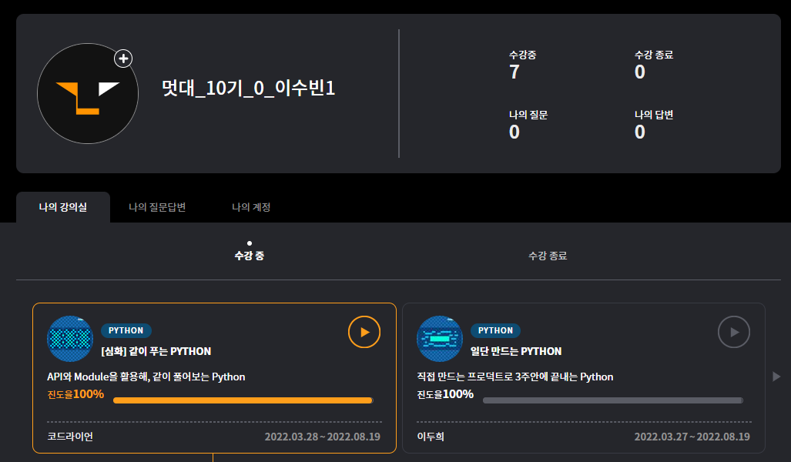

# 멋사 파이썬 심화

1. 실시간 검색어 확인하기

```python
from bs4 import BeautifulSoup
import requests
from datetime import datetime

url = "http://www.daum.net/"
response = requests.get(url)
soup = BeautifulSoup(response.text, 'html.parser')
rank = 1

results = soup.findAll('a','link_favorsch')

search_rank_file = open("rankresult.txt","a")

print(datetime.today().strftime("%Y년 %m월 %d일의 실시간 검색어 순위입니다.\n"))

for result in results:
    search_rank_file.write(str(rank)+"위:"+result.get_text()+"\n")
    print(rank,"위 : ",result.get_text(),"\n")
    rank += 1
```

크롤러 : 데이터를 모아준다.

모듈과 함수 사용 가능

import `모듈명`

`모듈명` `.` `함수이름`

요청하고 응답받기

request 모듈

requests.get(url)

return → response

### Beautiful Soup

```python
import requests
from bs4 import BeautifulSoup

url = "http://www.daum.net/"
response = requests.get(url)
# print(response.text)

file = open("daum.html","w")
file.write(response.text)
file.close()

print(BeautifulSoup(response.text, 'html.parser'))
```

BeautifulSoup(response.text, 'html.parser') → type을 변환

class ‘bs4.BeautifulSoup’>

Beautiful Soup로 할 수 있는 것

Parsing → 데이터를 의미있게 변경하는 것

그걸 도와주는 프로그램이 parser

html.parser

soup = BeautifulSoup(response.text, 'html.parser')

soup.title → title 출력

soup.title.string → 실제 제목 string만 출력

soup.span → 가장 상단에 위치한 span 태그 하나만 출력

soup.findAll(’span’) → span 태그 모두 출력 요소 여러개 입력 가능

예쁘게 출력하기

→ 리스트 for문 이용해서 출력

result.get_text() → 텍스트만 뽑아줌

print(datetime.today().strftime("%Y년 %m월 %d일의 실시간 검색어 순위입니다.\n"))

파일로 출력

```python
from bs4 import BeautifulSoup
import requests
from datetime import datetime

url = "http://www.daum.net/"
response = requests.get(url)
soup = BeautifulSoup(response.text, 'html.parser')
rank = 1

results = soup.findAll('a','link_favorsch')

search_rank_file = open("rankresult.txt","w")

print(datetime.today().strftime("%Y년 %m월 %d일의 실시간 검색어 순위입니다.\n"))

for result in results:
    search_rank_file.write(str(rank)+"위:"+result.get_text()+"\n")
    print(rank,"위 : ",result.get_text(),"\n")
    rank += 1
```

file open mode

r : read

w : write

a : append

1. API 발급받기

API

응용 프로그램 인터페이스

Application Programming Interface

프로그램과 프로그램을 이어주는 연결고리

Client와 Server를 연결해준다

API를 사용한다 - 누가 만들어둔 기능을 규약에 맞춰 사용한다.

OpenAPI

openweathermap - 날씨 정보 확인 가능한 API

API key : 방명록과 같은 기능

파이썬의 fstring을 사용해서 문자열 안에 변수 넣기 가능

```python
import requests

city = "Seoul"
apikey = "################################"
api = f"http://api.openweathermap.org/data/2.5/weather?q={city}&appid={apikey}"

result = requests.get(api)
print(result.text)
```

```python
import json
data = json.loads(result.text)

print(type(result.text))
print(type(data))
```

```python
data = json.loads(result.text)

print(data["name"],"의 날씨입니다.")
print("날씨는 ",data["weather"][0]["description"],"입니다.")
print("현재 온도는 ",data["main"]["temp"],"입니다.")
print("하지만 체감 온도는 ",data["main"]["feels_like"],"입니다.")
# 최저 기온 : main - temp_min
print("최저 기온은 ",data["main"]["temp_min"],"입니다.")
# 최고 기온 : main - temp_max
print("최고 기온은 ",data["main"]["temp_max"],"입니다.")
# 습도 : main - humidity
print("습도는 ",data["main"]["humidity"],"입니다.")
# 기압 : main - pressure
print("기압은 ",data["main"]["pressure"],"입니다.")
# 풍향 : wind - deg
print("풍향은 ",data["wind"]["deg"],"입니다.")
# 풍속 : wind - speed
print("풍속은 ",data["wind"]["speed"],"입니다.")
```

1. 번역하기

googletrans 모듈 - 언어감지/번역기능

```python
from googletrans import Translator

translator = Translator()

# sentence = "안녕하세요 코드라이언입니다."
sentence = input("번역을 원하는 문장을 입력해주세요 : ")
dest = input("어떤 언어로 번역을 원하시나요?")

result = translator.translate(sentence,dest)
detected = translator.detect(sentence)

print("===========출 력 결 과===========")
print(detected.lang,":",sentence)
print(result.dest,":",result.text)
print("=================================")
```

국가코드

프랑스어 fr

아랍어 ar

베트남어 vi

독일어 de

스페인어 es

몽골어 mn

중국어 zh-CN

힌디어 hi

1. 메일 보내기

구글 지메일 설정에서 IMAP 사용 허용

메일 계정의 외부 접속에 대한 보안 설정 필요

SMTP

Simple Mail Transfer Protocol 메일을 보내기위한 약속

SMTP 서버를 이용해 원하는 곳으로 메일을 보낼 수 있다.

Email Client가 Email을 보내면

SMTP에 맞춰서 Email Server에 전송

또 SMTP에 맞춰서 다른 Email Server로 전송

Email Server는 Email Client한테 IMAP을 이용해서 전송

1. SMTP 메일 서버 연결

2. SMTP 메일 서버에 로그인

3. SMTP 메일을 보낸다

SSL 암호화 방식 필요 smtplib.SMTP_SSL

```python
import smtplib

SMTP_SERVER = "smtp.gmail.com"
SMTP_PORT = 465

smtp = smtplib.SMTP_SSL(SMTP_SERVER,SMTP_PORT)
smtp.login("###@@gmail.com","######")
```

gamil 계정으로 로그인해줌

MIME으로 명령을 Server에 전달할 수 있게 해줌

Header부분 값 지정해서 발신자 수신자 설정

```python
message = EmailMessage()
message.set_content("코드라이언 수업중입니다.")

message["Subject"] = "이것은 제목입니다."
message["From"] = "###@gmail.com"
message["To"] = "###@gmail.com"
```

메일 전송

```python

from email.message import EmailMessage

smtp.send_message(message)
smtp.quit()
```

사진 첨부해서 전송하기

rb : read binary

wb : write binary

ab : append binary

open으로 파일 열기

add_attachment 이용해서 첨부

imghdr 모듈 사용

```python
with open("codelion.png","rb") as image:
    image_file = image.read()

image_type = imghdr.what('codelion',image_file)
message.add_attachment(image_file,maintype='image',subtype=image_type)
```

유효성 검사

메일 주소가 형식에 맞는지 체크

re 모듈 사용

정규표현식 형식

`^[a-zA-Z0-9.+_-]+@[a-zA-Z0-9]+\.[a-zA-Z]{2,3}`

^ → 시작

+→ 붙이기

\. → “.”

$ → 끝

```python
reg = "^[a-zA-Z0-9.+_-]+@[a-zA-Z0-9]+\.[a-zA-Z]{2,3}$"
print(re.match(reg,"codelion.examplegmailcom"))
```

```python
def sendEmail(addr):
    reg = "^[a-zA-Z0-9.+_-]+@[a-zA-Z0-9]+\.[a-zA-Z]{2,3}$"
    if bool(re.match(reg,addr)):
        smtp.send_message(message)
        print("정상적으로 메일이 발송되었습니다.")
    else:
        print("유효한 이메일 주소가 아닙니다.")
```
